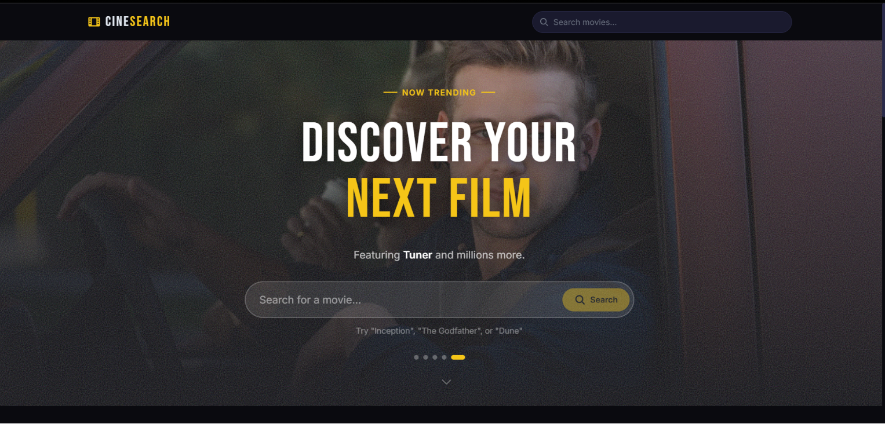
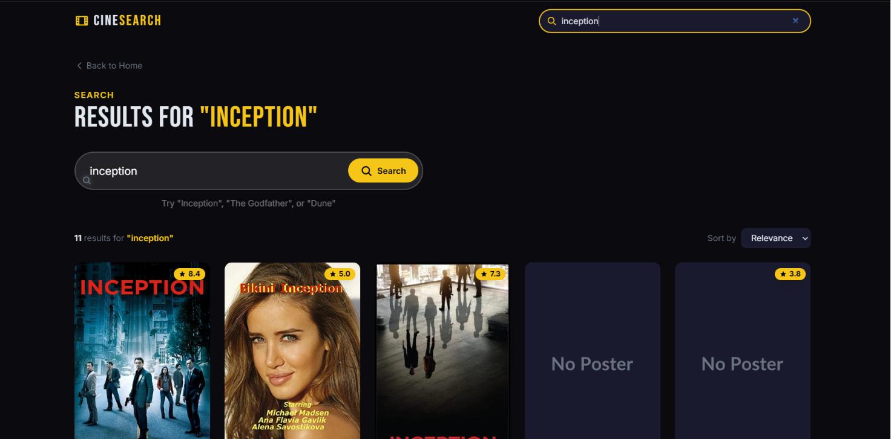
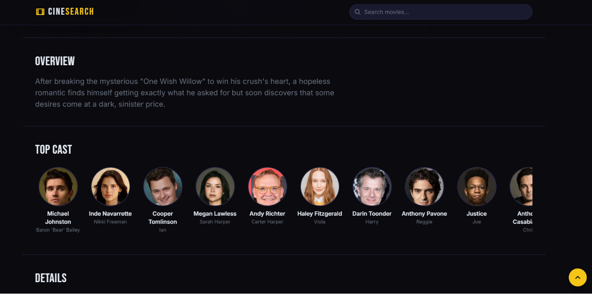

# 🎬 CineSearch – Modern Movie Discovery Platform

A modern movie discovery platform built using **React, Vite, Tailwind CSS, React Router DOM, and TMDB API**.

CineSearch allows users to discover trending movies, search films instantly, explore detailed movie information, watch trailers, browse cast information, and find similar movie recommendations through a clean and cinematic user experience.

---

## 🌐 Live Demo

🔗 https://cinesearch-mu.vercel.app/

---

## ✨ Features

### 🔍 Smart Movie Search

* Real-time movie search
* Debounced API requests
* Fast and responsive search experience
* Dynamic movie results

### 🎬 Trending Movies

* Trending movies section
* Cinematic hero banner
* Dynamic movie discovery

### 📖 Detailed Movie Information

* Movie overview
* Ratings and vote counts
* Runtime and release date
* Production information
* Original language
* Similar movie recommendations

### 🎭 Cast & Crew

* Top cast display
* Scrollable cast section
* Actor information

### 🎥 Trailer Integration

* Watch trailers directly
* YouTube trailer support

### ⚡ Modern User Experience

* Skeleton loading states
* Error handling
* Responsive design
* Smooth page transitions
* Sticky navigation bar
* Scroll-to-top functionality

---

## 🖼️ Screenshots

### Home Page



### Search Results



### Movie Details



---

## 🏗️ Project Architecture

```text
movie-app/
├── src/
│
├── api/
│   └── tmdb.js
│
├── hooks/
│   ├── useDebounce.js
│   ├── useFetch.js
│   ├── useSearch.js
│   ├── useMovieDetails.js
│   └── usePageTitle.js
│
├── components/
│   ├── MovieCard.jsx
│   ├── MovieGrid.jsx
│   ├── SkeletonCard.jsx
│   ├── HeroSection.jsx
│   ├── SearchBar.jsx
│   ├── SearchFilters.jsx
│   ├── RatingRing.jsx
│   ├── CastRow.jsx
│   ├── TrailerButton.jsx
│   ├── ScrollToTop.jsx
│   └── ui/
│
├── pages/
│   ├── Home.jsx
│   ├── SearchResults.jsx
│   └── MovieDetails.jsx
│
├── utils/
│   └── helpers.js
│
├── App.jsx
├── main.jsx
└── index.css
```

---

## 🛠️ Tech Stack

### Frontend

* React.js
* Vite
* Tailwind CSS
* React Router DOM

### API

* TMDB API

### State Management

* React Hooks
* Custom Hooks

### UI/UX

* Responsive Design
* Skeleton Loading
* Route Transitions
* Reusable Components

---

## 🚀 Getting Started

### Clone Repository

```bash
git clone https://github.com/Swastik99-git/cinesearch.git
cd cinesearch
```

### Install Dependencies

```bash
npm install
```

### Create Environment Variable

Create a `.env` file in the root directory:

```env
VITE_TMDB_API_KEY=YOUR_TMDB_API_KEY
```

### Run Development Server

```bash
npm run dev
```

### Build For Production

```bash
npm run build
```

---

## 🎯 Learning Outcomes

This project helped me improve my skills in:

* API Integration
* React Hooks
* Custom Hooks Development
* Dynamic Routing
* Error Handling
* Component-Based Architecture
* Responsive Design
* Performance Optimization
* Reusable UI Development

---

## 📈 Future Improvements

* User Authentication
* Personal Watchlist
* Favorite Movies
* Genre-Based Filtering
* Infinite Scrolling
* AI Movie Recommendations
* Dark / Light Theme

---

## 👨‍💻 Author

### Swastik Biswal

Full Stack Developer

🔗 GitHub: https://github.com/Swastik99-git

---

## ⭐ Support

If you found this project useful, consider giving it a ⭐ on GitHub.
